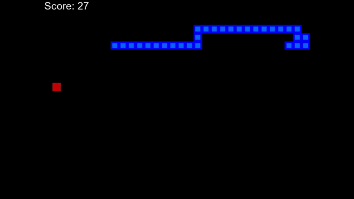

# Sneak Game with Reinforcement Learning 🐍

Self Training Sneak Game with Reinforcement Learning, Python, Pytorch and Pygame

This Model was trained during almost 10 minutes of Gameplay, and using concepts such as Agent, Reward, Enviroment, State and Memory. At this current version, The Model can score 40 or more points.

To test the Saved Model, run `agent_with_saved_model.py`, or to Train a new Model, run `agent_with_new_model.py`

## Check-it out
- Sneak Game with Reinforcement Learning Preview: https://youtu.be/FiyK-_bB75g

